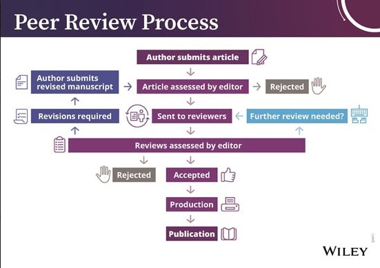

# Phương pháp luận nghiên cứu khoa học - CS519.M11
## Giới thiệu môn học
Môn học hướng về việc trang bị cho sinh viên những kiến thức cơ bản về khoa học và nghiên cứu khoa học nhằm mục đích nâng cao chất lượng của các đề cương và các luận văn tốt nghiệp. Qua các thí dụ cụ thể, các tiến trình trong nghiên cứu khoa học được bổ sung bởi những mô hình và lý thuyết để bồi dưỡng cho sinh viên về phương pháp thực dụng trong nghiên cứu khoa học: cách đặt vấn đề khoa học; phương pháp giải quyết các bài toán trong tin học; áp dụng các thủ thuật sáng tạo trong các bài toán tin học; các phương pháp suy luận, tư duy giả thuyết khoa học; cách viết bài báo khoa học, và sau cùng là các vấn đề liên quan đến đạo đức của người làm khoa học.

## Đánh giá

Gồm có 2 phần chính:

1. Quá trình: 35%
- Trả lời câu hỏi trên Google Classroom
- Điểm danh
- Điểm khuyến khích

2. Thi cuối kỳ

    2.1. Seminar theo nhóm: 25%  
    2.2. Đồ án:
    - Đề cương đề tài NCKH nộp trên Classroom: 40%
+ Báo cáo ngắn ppt (5-10 slides), poster
+ Báo cáo chi tiết doc (3-5 trang)
+ Điểm khuyến khích

## Bài giảng
- GIỚI THIỆU MÔN HỌC  
        Mục tiêu:  
        - Giới thiệu các khái niệm, thuật ngữ trong NCKH.   
        - Giới thiệu và thực hành các kỹ năng NCKH.  
        - Phát triển một đề cương NCKH có thể dùng cho
        đề tài NCKH-SV khóa luận tốt nghiệp.  
         
        Các nội dung:  
        - Tư duy phản biện (critical thinking)  
        - Tư duy tính toán (computational thinking)  
        - Kỹ năng đặt câu hỏi  
        - Kỹ năng tìm kiếm, xác định nguồn tài liệu tin cậy  
        - Kỹ năng dùng mindmap  
        - Kỹ năng đọc bài báo KH  
        - Kỹ năng trình bày  
        - Kỹ năng viết paragraph  
        - Kỹ năng viết đề cương: mục tiêu → nội dung → phương pháp  
- RESEARCH vs SCIENTIFIC RESEARCH vs SCIENTIFIC METHOD: [Đọc tại đây](https://github.com/thongvhoang/CS519.M11/blob/master/RESEARCH%20vs%20SCIENTIFIC%20RESEARCH%20vs%20SCIENTIFIC%20METHOD.md)
- RESEARCH - CÁC THUẬT NGỮ: [Đọc tại đây](https://github.com/thongvhoang/CS519.M11/blob/master/RESEARCH%20-%20C%C3%81C%20THU%E1%BA%ACT%20NG%E1%BB%AE.md)
- TYPE OF SCIENTIFIC RESEARCH  - KHCB vs KHUD: [Đọc tại đây](https://github.com/thongvhoang/CS519.M11/blob/master/TYPE%20OF%20SCIENTIFIC%20RESEARCH%20%20-%20KHCB%20vs%20KHUD.md)
- HOW TO LEARN - JOHN VŨ - TIẾN HOÁ TRONG MÙA DỊCH: [Đọc tại đây](https://vnexpress.net/tien-hoa-trong-mua-dich-4273974.html)
- HOW TO LEARN - HỌC NHƯ THẾ NÀO CHO HIỆU QUẢ: [Đọc tại đây](https://zingnews.vn/video-gs-truong-nguyen-thanh-tu-van-cach-hoc-de-lam-viec-voi-robot-post922606.html)
- RESEARCH EVALUATION :  
    - DE-MYSTIFYING GOOD RESEARCH AND GOOD PAPERS: [Đọc tại đây](https://github.com/thongvhoang/CS519.M11/blob/master/De-Mystifying%20Good%20Research%20and%20Good%20Papers%20(repost).pdf)  
        Source: https://bigaidream.gitbooks.io/tech-blog/content/2014/de-mystifying-good-research.html  
    - BÌNH DUYỆT NGANG HÀNG - PEER REVIEW PROCESS:  
        &nbsp;&nbsp;&nbsp;&nbsp;&nbsp;&nbsp;&nbsp;&nbsp;&nbsp;&nbsp;&nbsp;&nbsp;&nbsp;1. Peer Review Process là gì và được áp dụng thế nào trong việc bình duyệt các bài báo KH hiện nay?  
        &nbsp;&nbsp;&nbsp;&nbsp;&nbsp;&nbsp;&nbsp;&nbsp;&nbsp;&nbsp;&nbsp;&nbsp;&nbsp;2. Các mặt trái/hạn chế của Peer Review? Có thật sự công bằng, có thật sự là mô hình tốt nhất?  
        - Câu chuyện của PageRank, SIFT  
        - Câu chuyện của Yann LeCun và sự ra đời của top conference ICLR - OpenReview   
        
        &nbsp;&nbsp; &nbsp;&nbsp; &nbsp;&nbsp; &nbsp;&nbsp;
            3. Types of Peer Review: Single Blind Review, Double Blind Review, Triple Blind Review, etc  
        &nbsp;&nbsp;&nbsp;&nbsp;&nbsp;&nbsp;&nbsp;&nbsp;&nbsp;&nbsp;&nbsp;&nbsp;4. Vấn đề Conflict of Interest  
    Đọc thêm tại đây:  
        - Springer Peer Review:
        
        - Wiley Peer Review:
        
        - [What is peer review?](https://www.elsevier.com/reviewers/what-is-peer-review)
        - [Scrutinizing science: Peer review](https://undsci.berkeley.edu/article/howscienceworks_16)
        - [In scientific journals, what is meant by "peer review"?](https://www.quora.com/In-scientific-journals-what-is-meant-by-peer-review)
        - [The NIPS experiment](http://blog.mrtz.org/2014/12/15/the-nips-experiment.html)
        - Bình duyệt đồng nghiệp: [Link](https://www.lypham.net/?p=1113)
        - Type of peer review: [Link](https://authorservices.wiley.com/Reviewers/journal-reviewers/what-is-peer-review/types-of-peer-review.html)
        - Exploring the Peer Review Process: [Link](https://www.wiley.com/network/researchers/being-a-peer-reviewer/exploring-the-peer-review-process)
    - XẾP HẠNG TẠP CHÍ - HỘI NGHỊ KH:
        - TIÊU CHÍ XÉT DUYỆT TẠP CHÍ KHOA HỌC CỦA SCOPUS VÀ ISI: [Link](https://vnuhcm.edu.vn/doi-ngoai_34306864/tieu-chi-xet-duyet-tap-chi-khoa-hoc-cua-scopus-va-isi/323433316864.html)
        - DANH MỤC CÁC TẠP CHÍ KHOA HỌC ĐƯỢC XẾP HẠNG: [Link](https://github.com/thongvhoang/CS519.M11/blob/master/PHAN%20LOAI%20TAP%20CHI%20THEO%20CHUAN%20ISI%2C%20SCOPUS.pdf)
        - Quy định của Quỹ phát triển KH & CN quốc gia (NAFOSTED): [Link](https://www.hcmus.edu.vn/component/content/article?id=2128:quy-dinh-cua-quy-phat-trien-kh-cn-quoc-gia-nafosted&catid=249&Itemid=437)
- RESEARCH PUBLICATIONS - CÔNG BỐ KHOA HỌC VÀ ĐÁNH GIÁ NGHIÊN CỨU: [RESEARCH PUBLICATIONS - CÔNG BỐ KHOA HỌC VÀ ĐÁNH GIÁ NGHIÊN CỨU.md](https://github.com/thongvhoang/CS519.M11/blob/master/RESEARCH%20PUBLICATIONS%20-%20C%C3%94NG%20B%E1%BB%90%20KHOA%20H%E1%BB%8CC%20V%C3%80%20%C4%90%C3%81NH%20GI%C3%81%20NGHI%C3%8AN%20C%E1%BB%A8U.md)
    -        

## Quá trình
Q1.1 - Tự giới thiệu
- Họ và tên: Võ Hoàng Thông
- Ngành Khoa học Dữ liệu 2018
- Sở thích: Chạy bộ, nghiên cứu, đọc sách, xem phim
- Định hướng nghề nghiệp: Research Scientist
- Chia sẻ, kết nối với mình qua facebook nha :))) https://www.facebook.com/thongvo####/  

Q3.1 - VÌ SAO BẠN CHỌN MÔN HỌC NÀY
- Kỹ năng nghiên cứu và phương pháp luận cho việc nghiên cứu khoa học.
- Các bước để viết một bài báo khoa học đúng chuẩn một nhà khoa học.
- Tư duy suy luận và cách đặt giả thuyết khoa học như một nhà khoa học thực thụ.

Q3.2 - BẠN MONG ĐỢI HỌC VÀ LÀM ĐƯỢC GÌ SAU KHI HỌC XONG MÔN HỌC NÀY
- Các kỹ năng nghiên cứu khoa học của một nhà khoa học.
- Hiểu tường tận quá trình làm một đề tài nghiên cứu khoa học từ tìm tìm tài liệu, đọc paper, viết literature review, cho đến thực nghiệm và sản phẩm là bài báo.

Q3.3 - HÃY ĐẶT CÂU HỎI VỀ MÔN HỌC NÀY
- Tại sao sinh viên phải biết phương pháp luận về nghiên cứu khoa học ?
- Sinh viên cần chuẩn bị những gì về mặt tư duy và thái độ để có phương pháp luận như một nhà khoa học ?
- Một nghiên cứu khoa học như thế nào được gọi là đúng chuẩn về phương pháp luận ?

Q3.4 - GÓP Ý CHO PHƯƠNG PHÁP GIẢNG DẠY
- Tăng cường tương tác giữa sinh viên và giảng viên.
- Những ví dụ gợi mở gần gũi trong đời sống mô tả cho phần lý thuyết. Ví dụ như hình ảnh, bài giảng video.
- Học đi đôi với hành.

Q4.1.1 - 5W1H - TÌM HIỂU  
Tìm hiểu về 5W1H và viết tóm tắt trong file [5W1H.md](https://github.com/thongvhoang/CS519.M11/blob/master/5W1H.md) lưu trên GitHub Repos của nhóm

Q4.2 - 5-SENTENCE PARAGRAPH  
Tìm hiểu về 5 Sentence Paragraph và viết tóm tắt trong file [5SentenceParagraph.md](5SentenceParagraph.md) lưu trên GitHub Repos của nhóm.

## Tài liệu tham khảo
- Sách tham khảo: 
    - [The craft of research, Third Edition](https://github.com/thongvhoang/CS519.M11/blob/master/The_Craft_of_Research.pdf)
    - [The craft of research, Fourth Edition](https://github.com/thongvhoang/CS519.M11/blob/master/The_Craft_of_Research_Fourth_Edition.pdf)
- Khởi nghiệp và triệu phú: [Link bài viết](https://vnexpress.net/khoi-nghiep-va-trieu-phu-4279807.html)
- Nobel Vật lý 2014: Đi tìm nàng công chúa xanh dương: [Link bài viết](https://tuoitre.vn/nobel-vat-ly-2014%C2%A0di-tim-nang-cong-chua-xanh-duong-659146.htm)
- Nghiên cứu khoa học: Trình độ học sinh phổ thông ngang Tiến sĩ? [Link bài viết](https://vietnamnet.vn/vn/giao-duc/khoa-hoc/nghien-cuu-khoa-hoc-trinh-do-hoc-sinh-pho-thong-ngang-tien-si-723452.html)
- TRI THỨC THÔNG THƯỜNG vs TRI THỨC KHOA HỌC: [Đọc tại đây](https://github.com/thongvhoang/CS519.M11/blob/master/TRI%20TH%E1%BB%A8C%20TH%C3%94NG%20TH%C6%AF%E1%BB%9CNG%20vs%20TRI%20TH%E1%BB%A8C%20KHOA%20H%E1%BB%8CC.md)
- GỐC VÀ NGHĨA CỦA CÁC TỪ KHOA HỌC, CÔNG NGHỆ VÀ KỸ THUẬT: [Link bài viết](https://www.vnu.edu.vn/btdhqghn/?C1991/N12677/Goc-va-nghia-cua-cac-tu-khoa-hoc,-cong-nghe-va-ky-thuat.htm)

## Về chúng tôi
Tên nhóm: THL
1. Võ Hoàng Thông, sinh viên ngành Khoa học Dữ liệu khóa 2018.  
2. [Lâm Gia Huy](https://github.com/huylgia/CS519.M11), sinh viên ngành Khoa học Dữ liệu khóa 2018.  
3. [Nguyễn Ngân Linh](https://github.com/tteokl/CS519.M11), sinh viên ngành Khoa học Dữ liệu khóa 2018.  

Nhóm tác giả đến từ Trường Đại học Công nghệ Thông tin ĐHQG-HCM.

